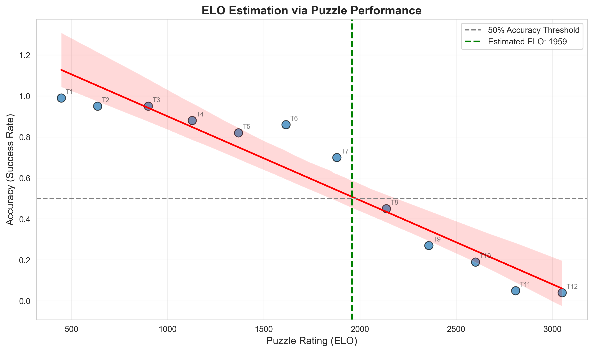
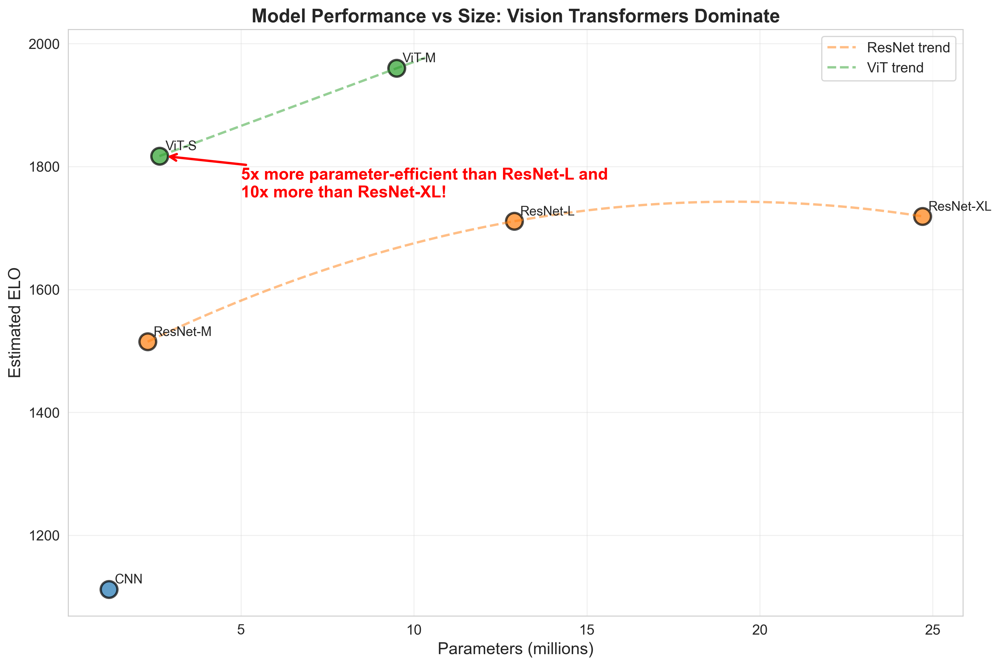

# ♟️ Searchless Chess: Master-Level Chess Through Pure Neural Intuition

[](https://www.tensorflow.org/)
[](https://keras.io/)
[](https://huggingface.co/datasets/mateuszgrzyb/lichess-stockfish-normalized)
[](https://www.python.org/downloads/)
[](https://opensource.org/licenses/MIT)

> **TL;DR:** Neural chess engine achieving ~1960 ELO without search. 
> Vision Transformers prove 10x more parameter-efficient than ResNets. 
> Trained on 316M positions over 200+ hours on A100. All code, models, 
> and dataset openly available.

A neural network that plays chess without search algorithms—relying purely 
on learned intuition from millions of positions evaluated by Stockfish.

**Inspired by:** Google DeepMind's [*"Grandmaster-Level Chess Without Search"*](https://arxiv.org/html/2402.04494v1)

## 🎯 About
This project demonstrates that neural networks can develop chess intuition without performing any search. The model:

- **Evaluates positions** based on centipawn (cp) scores from deep Stockfish analysis
- **Predicts optimal moves** directly from FEN notation
- **Learns strategic patterns** from millions of positions

No minimax. No alpha-beta pruning. Pure neural intuition.

## 🔗 Quick Links
- 📦 [HuggingFace Dataset](https://huggingface.co/datasets/mateuszgrzyb/lichess-stockfish-normalized) - 316M deduplicated positions
- 🤖 [Pre-trained Models](https://huggingface.co/mateuszgrzyb) - Download ready-to-use weights (coming soon)
- 📓 [Technical Blog Post](#) - Deep dive into methodology (coming soon)
- 🎮 [Play Against the Bot](#) - Interactive demo (coming soon)

## 🏆 Key Achievements
- ✅ **~1960 ELO without search** - pure value-based move selection
- ✅ **10x parameter efficiency** - ViT outperforms ResNet with ~90% fewer parameters
- ✅ **316M position dataset** - deduplicated, normalized, published on HuggingFace
- ✅ **Rigorous validation** - evaluated on 1200 Lichess puzzles across 12 difficulty tiers
- ✅ **200+ hours on NVIDIA A100** - self-funded training demonstrating individual-scale research

## 📊 Model Comparison
### Comparison with State-of-the-Art
Positioning this work within the broader landscape of chess engines:

Model          | Params | Dataset   | Training | ELO  | ELO/1M | Search?
---------------|--------|-----------|----------|------|--------|--------
Stockfish      | ~15M   | ~5B       | -        | 3500 | 233    | Yes
DeepMind       | 270M   | ~15B      | N/A      | 2895 | 10.7   | No*
ResNet-XL      | 24.7M  | ~316M     | N/A      | 1719 | 70     | No
**ViT-Small**  | 2.64M  | ~316M     | 24h      | 1817 | 688    | No
**ViT-Medium** | 9.5M   | ~316M     | 72h      | 1960 | 206    | No

*DeepMind's model used action prediction (policy head) trained on 
move sequences, not explicit search. See [their paper](https://arxiv.org/html/2402.04494v1) for details.
### Trained Models Performance
| Model          | Params | ELO  | Tier 4 (1000-1250) | Tier 6 (1500-1750) | Tier 8 (2000-2250) |
|----------------|--------|------|--------------------|--------------------|--------------------|
| CNN            | 1.18M  | 1112 | 43%                | 22%                | 7%                 |
| ResNet-M       | 2.3M   | 1515 | 68%                | 40%                | 15%                |
| ResNet-L       | 12.9M  | 1711 | 76%                | 59%                | 23%                |
| ResNet-XL      | 24.7M  | 1719 | 72%                | 61%                | 27%                |
| **ViT-Small**  | 2.64M  | 1817 | 82%                | 68%                | 34%                |
| **ViT-Medium** | 9.5M   | 1960 | 88%                | 86%                | 45%                |

### Efficiency Analysis

Working with:
- **28x fewer parameters** (9.5M vs DeepMind's 270M)
- **47x less training data** (316M vs 15B positions)
- **Individual compute budget** (>200h on NVIDIA A100)

The model achieved **67% of DeepMind's ELO** using **<4% of their resources**.

**Key insight:** Neural chess intuition scales efficiently at smaller scales, 
demonstrating that cutting-edge AI research is accessible beyond corporate labs.

**Key observations:**
- All models perform well on Tier 4 puzzles (beginner-level tactics)
- Performance divergence becomes pronounced at Tier 6+ (intermediate-advanced)
- ViT architectures maintain higher accuracy across all difficulty levels
- ResNet performance plateaus despite parameter scaling (12M → 24M yields minimal ELO gain)

## 🧮 Evaluation Methodology
### ELO Estimation via Puzzle Performance
Model strength was estimated using a rigorous puzzle-based evaluation approach:

**Dataset:**
- 1,200 Lichess puzzles spanning 12 difficulty tiers
- Rating range: 399-3213 ELO
- 100 puzzles per tier for statistical significance
- Each puzzle tagged with the rating of the player who originally faced that position

**Evaluation Process:**

1. **Puzzle Solving:** Each model attempts to solve all 1,200 puzzles
   - Model generates best move for current position
   - Success = finding the correct tactical sequence
   - Partial credit for correct initial moves

2. **Tier-Level Aggregation:** Success rates calculated per rating tier
   ```
    Example: Tier 4 (1000-1250 ELO) → ViT-Medium 88% accuracy
             Tier 8 (2000-2250 ELO) → ViT-Medium 45% accuracy
   ```

3. **Linear Regression Mapping:** 
   - X-axis: Mean puzzle rating per tier
   - Y-axis: Model accuracy (% solved) for that tier
   - Fit linear regression: `Rating = f(Accuracy)`
   - **ELO estimate** = predicted rating at 50% accuracy threshold

4. **Validation:** Results plotted to visualize accuracy decay across difficulty spectrum


*Figure: ELO estimation via linear regression. The intersection at 50% accuracy yields the estimated playing strength.*

**Why Puzzles Are Valid for Search-Free Models:**

Traditional engines benefit from search depth in puzzles—finding 2-3 move sequences by exploring the game tree. However, **searchless models evaluate only the immediate position**, making them functionally equivalent to "search depth = 1" players.

This means:
- Puzzle difficulty directly correlates with position evaluation complexity
- Multi-move tactics must be recognized from static position patterns alone
- The 50% accuracy threshold accurately reflects human-equivalent playing strength at that rating level
- No artificial advantage from puzzle structure (unlike engines with search)

**Key Insight:** A searchless model solving a 2000 ELO puzzle demonstrates the same positional understanding as a 2000 ELO human would need—both rely on pattern recognition rather than calculation.

#### Performance Metrics
Models evaluated on three key dimensions:

1. **Overall ELO** - Estimated playing strength via regression
2. **Tier Success Rates** - Accuracy across difficulty levels
3. **Training Efficiency** - ELO per million parameters and per training hour

**Reproducibility:** Full evaluation code and puzzle dataset available in `notebooks/03_testing_model_elo_on_lichess_puzzles.ipynb`

## 🔬 Key Discoveries
### Vision Transformers vs ResNets



*Figure 1: ELO performance vs model size. ViT achieves superior parameter efficiency.*

The most surprising finding: **Vision Transformers are dramatically more 
parameter-efficient than ResNets for chess position evaluation.**

**Key observations:**
- ViT-Small (2.64M) achieved higher ELO than ResNet-XL (24M) → **~10x fewer parameters**
- ResNet plateaus: 12M→24M params = only +8 ELO improvement
- ViT scaling: continues improving, suggesting headroom for larger models
- ViT-Small achieves **688 ELO per million parameters** vs ResNet-L ~133 and ResNet-XL ~70

**Why transformers excel:**
Chess positions require global reasoning—understanding how pieces across 
the entire board coordinate. ViT's self-attention mechanism naturally captures 
these long-range dependencies, while ResNet's local convolutions must stack 
many layers to approximate the same receptive field.

This aligns with recent research showing transformer superiority in tasks 
demanding holistic scene understanding.

## 🚀 Quick Start

### Download Pre-trained Models

All models are available via [GitHub Releases](https://github.com/mateuszgrzyb-pl/searchless-chess/releases/latest):

```bash
# Download the best model (ViT-Medium)
wget https://github.com/mateuszgrzyb-pl/searchless-chess/releases/download/v1.0.0/05-vit-small-v1.0.0.zip
unzip vit-medium-v1.0.0.zip
```

Or download directly from the [Releases page](https://github.com/mateuszgrzyb-pl/searchless-chess/releases).

### Basic Usage

```python
import chess
from src.chess_ai.core.model import ChessAI

# Load the chess engine (works with any model)
chess_bot = ChessAI('vit_medium/model.keras')

# Create a chess board
board = chess.Board()

# Make moves
board.push_san("e4")  # Your move
engine_move = chess_bot.make_move(board)  # Engine responds
board.push(engine_move)

print(board)
print(f"Engine played: {engine_move}")
```

**Note:** Model evaluations are in the range `[-1, 1]` (normalized scores), not centipawns. Values represent position quality from the side-to-move perspective.

### Advanced Loading Options

For detailed examples including:
- Loading ResNet/CNN models (standard Keras)
- Loading ViT models (requires custom objects)
- Direct model inference without ChessAI wrapper
- Fine-tuning and transfer learning

See the complete guide: **[docs/model_loading_guide.md](docs/model_loading_guide.md)**

## 📊 Dataset
### Original training data from **Lichess** via HuggingFace:
- [Lichess/chess-position-evaluations](https://huggingface.co/datasets/Lichess/chess-position-evaluations)
- ~784M of positions with Stockfish deep analysis

### Transformed, ready-to-Use Training Dataset (HuggingFace)

A fully processed, **deduplicated** version of the Lichess evaluation database is available for this project:

- **316,072,343** unique chess positions (FEN-based deduplication, keeping max `depth`)
- Stored in **Parquet**, split into **10 parts** (~32M positions each)
- Optimized for ML pipelines — fast loading, reduced size, unnecessary fields removed
- Licensed under **CC BY 4.0**

Example of usage:
```python
from datasets import load_dataset
dataset = load_dataset("mateuszgrzyb/lichess-stockfish-normalized", split="train")
```
Dataset page: [https://huggingface.co/datasets/mateuszgrzyb/lichess-stockfish-normalized](https://huggingface.co/datasets/mateuszgrzyb/lichess-stockfish-normalized)

**Processing:** This dataset is the output of `scripts/stage_2_deduplicate_data.py`, which performs global deduplication across all Stage 1 files, then splits the result into 10 parts for distribution.

## 🛠️ Tech Stack
**Framework Evolution:**
- Started with PyTorch for rapid prototyping
- Migrated to TensorFlow/Keras for superior GPU utilization (60% → 90% on A100)
- Keras 3.12 for clean, maintainable code

**Key Technologies:**
- TensorFlow 2.20 / Keras 3.12 - Deep learning framework
- HuggingFace Datasets - Data pipeline and hosting
- Poetry - Dependency management
- Python 3.11+ - Core language

**Infrastructure:**
- NVIDIA A100 (40GB) - Primary training compute
- Google Colab Pro+ - Development environment
- TFRecord format - Efficient data streaming

## 🚀 Installation

### Download code
```bash
git clone https://github.com/mateuszgrzyb-pl/searchless-chess.git
cd searchless-chess
```

### Create venv with Poetry... (recommended)
```bash
poetry install
poetry shell
```

### ...or install requirements with pip.
```bash
pip install -r requirements.txt
```

## 📚 References

- [Google DeepMind: Grandmaster-Level Chess Without Search](https://arxiv.org/html/2402.04494v1)
- [DeepMind GitHub Repository](https://github.com/google-deepmind/searchless_chess)
- [Lichess Dataset on HuggingFace](https://huggingface.co/datasets/Lichess/chess-position-evaluations)

## 📝 Citation

If you use this work in your research, please cite:
```bibtex
@software{grzyb2024searchless,
  author = {Grzyb, Mateusz},
  title = {Searchless Chess: Master-Level Chess Through Pure Neural Intuition},
  year = {2025},
  url = {https://github.com/mateuszgrzyb-pl/searchless-chess},
  note = {Neural chess engine achieving ~1960 ELO without search}
}
```

## 📄 License
MIT License

## 📧 Contact

* **LinkedIn:** [Mateusz Grzyb](https://www.linkedin.com/in/mateusz--grzyb/)
* **Blog PL:** [MateuszGrzyb.pl](https://mateuszgrzyb.pl)
* **GitHub:** [mateuszgrzyb-pl](https://github.com/mateuszgrzyb-pl)